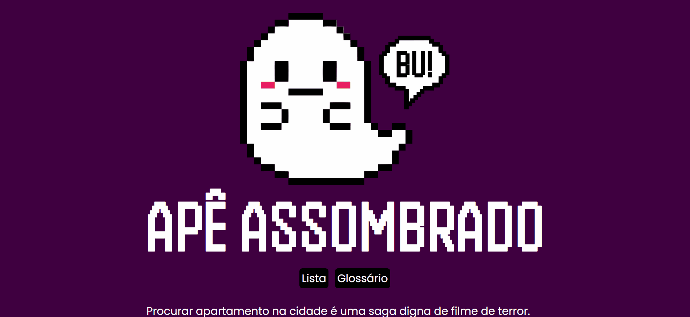
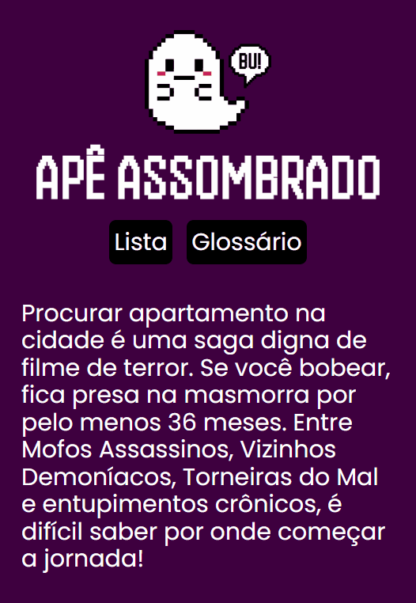

# Apê Assombrado: uma To-do list com uma virada :P

A tão falada to-do list! Quase todo curso nos ensina a montar uma, e já é sabido que nós - os iniciantes - aprendemos muito através desses projetos simples. Resolvi fazer uma gracinha com a minha e transformar em algo útil (e fofo). 

É como diria Renato: "já morei em tanta casa que nem me lembro mais...". Não moro com meus pais, vivo de aluguel e sinto que cada novo apê traz consigo a promessa de um novo pesadelo hahahaha. Depois de passar os últimos anos me mudando 2-3 vezes por ano, resolvi juntar na listinha tudo que pode ser evitado com um pouco de atenção. 

Pra ninguém ficar boiando, montei também um Glossário que explica cada item. 😉

## Nesse exercício aprendi/relembrei:

- Como guardar coisas no local storage (e como acessar elas depois hehe).
- Um pouquinho mais sobre manipulação do DOM (o cara mais manipulado da história, tá pior que um mocinho de novela HAHA)
- Modo claro/modo escuro. Usei no Glossário pra praticar e me divertir hehe (já estou de olho em qual é a melhor forma de fazer em projetos maiores, mas não consigo decidir qual framework estudar. :P)
- Um pouquinho mais sobre JS

## Nesse exercício confirmei:
- Se você não é herdeiro ou DEV senior (kkkkkk), morar de aluguel é uma provação. Nas minhas próximas visitas vou acessar a listinha, rezar para todos os santos e torcer pra não ser vítima dos temidos vícios ocultos! Oremos! 🙏

Tem dicas de melhoria? Achou tudo horrível? Achou bonitinho e quer conversar? Fala comigo! Estudo por conta própria e é super difícil conseguir feedback, então todo comentário será bem recebido! 💟

## Algumas imagens, porque eu amo GIFs hehe:

| Versão mobile da Home:| Versão mobile do Glossário:|
| ---------------------- | ---------------------- |
|  |  |

### Versão desktop do Glossário:

